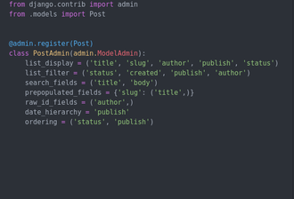

# django3-cheat-sheet

## Model field reference

```python
from django.db import models
```

- Field options
  * null  
  * blank
  * choices
  * db_column
  * db_index
  * db_tablespace
  * default
  * editable
  * error_messages
  * help_text
  * primary_key
  * unique
  * unique_for_date
  * unique_for_month
  * unique_for_year
  * verbose_name
  * validators

- Fields types
  * AutoField
    ```python
    class AutoField(**options)
    ```
  * BigAutoField
    ```python
    class BigAutoField(**options)
    ```
  * BigIntegerField
  ```python
  class BigIntegerField(**options)
  ```
  * BinaryField
    ```python
    class BinaryField(max_length=None, **options)
    ```
  * BooleanField
    ```python
    class BooleanField(**options)
    ```
  * CharField
    ```python
    class CharField(max_length=None, **options)
    ```
  * DateField
    ```python
    class DateField(auto_now=False, auto_now_add=False, **options)
    ```
  * DateTimeField
    ```python
    class DateTimeField(auto_now=False, auto_now_add=False, **options)
    ```
  * DecimalField
    ```python
    class DecimalField(max_digits=None, decimal_places=None, **options)
    ```
  * DurationField
    ```python
    class DurationField(**options)
    ```
  * EmailField
  ```python
  class EmailField(max_length=254, **options)
  ```
  * FileField
    * FieldFile
  ```python
  class FileField(upload_to=None, max_length=100, **options)
  ```
  * FilePathField
  ```python
  class FilePathField(path=None, match=None, recursive=False, max_length=100, **options)
  ```
    * FilePathField.allow_files
    * FilePathField.allow_folders
  * FloatField
  ```python
  class FloatField(**options)
  ```
  * ImageField
  ```python
  class ImageField(upload_to=None, height_field=None, width_field=None, max_length=100, **options)
  ```
  * IntegerField
  ```python
  class IntegerField(**options)
  ```
  * GenericIPAddressField
  ```python
  class GenericIPAddressField(protocol=’both’, unpack_ipv4=False, **options)
  ```
  * NullBooleanField
  ```python
  class NullBooleanField(**options)
  ```
  * PositiveBigIntegerField
  ```python
  class PositiveBigIntegerField(**options)
  ```
  * PositiveIntegerField
  ```python
  class PositiveIntegerField(**options)
  ```
  * PositiveSmallIntegerField
  ```python
  class PositiveSmallIntegerField(**options)
  ```
  * SlugField
  ```python
  class SlugField(max_length=50, **options)
  ```
  This is a field intended to be used in URLs. A slug is a
  short label that contains only letters, numbers, underscores,
  or hyphens.
  * SmallAutoField
  ```python
  class SmallAutoField(**options)
  ```
  * SmallIntegerField
  ```python
  class SmallIntegerField(**options)
  ```
  * TextField
  ```python
  class TextField(**options)
  ```
  * TimeField
  ```python
  class TimeField(auto_now=False, auto_now_add=False, **options)
  ```
  * URLField
  ```python
  class URLField(max_length=200, **options)
  ```
  * UUIDField
  ```python
  class UUIDField(**options)
  ```

- Model Meta options
  * abstract
  * app_label
  * base_manager_name
  * db_table
    * Tablenames
  * db_tablespace
  * default_manager_name
  * default_related_name
  * get_latest_by
  * managed
  * order_with_respect_to
  * ordering
  * permissions
  * default_permissions
  * proxy
  * required_db_features
  * required_db_vendor
  * select_on_save
  * indexes
  * unique_together
  * index_together
  * constraints
  * verbose_name
  * verbose_name_plural
- Read-only Meta attributes
  * label
  * label_lower

- Relationship fields
  * ForeignKey
  ```python
  class ForeignKey(to, on_delete, **options)
  ```
    A many-to-one relationship. Requires two positional arguments:
    the class to which the model is related and the on_delete option.

    To create a recursive relationship – an object that has a many-to-one
    relationship with itself – use models.ForeignKey('self', on_delete=models.CASCADE)
      * ForeignKey on_delete arguments
        * CASCADE
          > Cascade deletes. Django emulates the behavior of the SQL constraint ON DELETE CASCADE and also deletes the object containing the ForeignKey.
          >
          > Model.delete() isn’t called on related models, but the pre_delete and post_delete signals are sent for all deleted objects.

        * PROTECT
          > Prevent deletion of the referenced object by raising ProtectedError, a subclass of django.db.IntegrityError.

        * SET_NULL
          > Set the ForeignKey null; this is only possible if null is   True.

        * SET_DEFAULT
          > Set the **ForeignKey** to its default value; a default for the **ForeignKey** must be set.

        * SET()
          > Set the **ForeignKey** to the value passed to SET(), or if a callable is passed in, the result of calling it. In most cases, passing a       callable will be necessary to avoid executing queries at the time your models.py is imported:

## Form fields

  * Field.clean(value)

   >Each Field instance has a clean() method, which takes a single argument and either raises a django.forms.ValidationError exception or returns the clean value:

   ```python
   >>> from django import forms
   >>> f = forms.EmailField()
   >>> f.clean('foo@example.com')
   'foo@example.com'
   >>> f.clean('invalid email address')
   Traceback (most recent call last):
   ...
   ValidationError: ['Enter a valid email address.']
   ```

- Core field arguments

   > Each Field class constructor takes at least these arguments. Some Field classes take additional, field-specific arguments, but the following should always be accepted

   * Field.required

   > By default, each Field class assumes the value is required, so if you pass an empty value – either None or the empty string ("") – then clean() will raise a ValidationError exception:

   ```python
   >>> from django import forms
   >>> f = forms.CharField()
   >>> f.clean('foo')
   'foo'
   >>> f.clean('')
   Traceback (most recent call last):
   ...
   ValidationError: ['This field is required.']
   >>> f.clean(None)
   Traceback (most recent call last):
   ...
   ValidationError: ['This field is required.']
   >>> f.clean(' ')
   ' '
   ```
   > To specify that a field is not required, pass required=False to the Field constructor:
   ```python
   >>> f = forms.CharField(required=False)
   >>> f.clean('foo')
   'foo'
   >>> f.clean('')
   ''
   >>> f.clean(None)
   ''
   >>> f.clean(0)
   ```
   > If a Field has required=False and you pass clean() an empty value, then clean() will return a normalized empty value rather than raising ValidationError. For CharField, this will be an empty string. For other Field classes, it might be None. (This varies from field to field.)

   * Field.label

   > The label argument lets you specify the “human-friendly” label for this field. This is used when the Field is displayed in a Form.

   ```python
   >>> from django import forms
   >>> class CommentForm(forms.Form):
   ...     name = forms.CharField(label='Your name')
   ...     url = forms.URLField(label='Your website', required=False)
   ...     comment = forms.CharField()
   >>> f = CommentForm(auto_id=False)
   >>> print(f)
   <tr><th>Your name:</th><td><input type="text" name="name" required></td></tr>
   <tr><th>Your website:</th><td><input type="url" name="url"></td></tr>
   <tr><th>Comment:</th><td><input type="text" name="comment" required></td></tr>
   ```

   * Field.label_suffix

   > The label_suffix argument lets you override the form’s label_suffix on a per-field basis:

   ```python
   >>> class ContactForm(forms.Form):
   ...     age = forms.IntegerField()
   ...     nationality = forms.CharField()
   ...     captcha_answer = forms.IntegerField(label='2 + 2', label_suffix=' =')
   >>> f = ContactForm(label_suffix='?')
   >>> print(f.as_p())
   <p><label for="id_age">Age?</label> <input id="id_age" name="age" type="number" required></p>
   <p><label for="id_nationality">Nationality?</label> <input id="id_nationality" name="nationality" type="text" required></p>
   <p><label for="id_captcha_answer">2 + 2 =</label> <input id="id_captcha_answer" name="captcha_answer" type="number" required></p>
   ```

   * Field.initial

   > The initial argument lets you specify the initial value to use when rendering this Field in an unbound Form.

   > The use-case for this is when you want to display an “empty” form in which a field is initialized to a particular value. For example:

   ```python
   >>> from django import forms
   >>> class CommentForm(forms.Form):
   ...     name = forms.CharField(initial='Your name')
   ...     url = forms.URLField(initial='http://')
   ...     comment = forms.CharField()
   >>> f = CommentForm(auto_id=False)
   >>> print(f)
   <tr><th>Name:</th><td><input type="text" name="name" value="Your name" required></td></tr>
   <tr><th>Url:</th><td><input type="url" name="url" value="http://" required></td></tr>
   <tr><th>Comment:</th><td><input type="text" name="comment" required></td></tr>
   ```

   > you can also pass any callable:

   ```python
   >>> import datetime
   >>> class DateForm(forms.Form):
   ...     day = forms.DateField(initial=datetime.date.today)
   >>> print(DateForm())
   <tr><th>Day:</th><td><input type="text" name="day" value="12/23/2008" required><td></tr>
   ```

   *The callable will be evaluated only when the unbound form is displayed, not when it is defined.*

   * Field.widget

   > The widget argument lets you specify a Widget class to use when rendering this Field.

   ```python
   from django import forms
   class EmailPostForm(forms.Form):
      name = forms.CharField(max_length=25)
      email = forms.EmailField()
      to = forms.EmailField()
      comments = forms.CharField(required=False,
      widget=forms.Textarea)
    ```

    * Field.help_text

    > The help_text argument lets you specify descriptive text for this Field. If you provide help_text, it will be displayed next to the Field when the Field is rendered by one of the convenience Form methods (e.g., as_ul()).
    Like the model field’s help_text, this value isn’t HTML-escaped in automatically-generated forms.

    ```python
    >>> from django import forms
    >>> class HelpTextContactForm(forms.Form):
    ...     subject = forms.CharField(max_length=100, help_text='100 characters max.')
    ...     message = forms.CharField()
    ...     sender = forms.EmailField(help_text='A valid email address, please.')
    ...     cc_myself = forms.BooleanField(required=False)
    >>> f = HelpTextContactForm(auto_id=False)
    >>> print(f.as_table())
    <tr><th>Subject:</th><td><input type="text" name="subject" maxlength="100" required><br><span class="helptext">100 characters max.</span></td></tr>
    <tr><th>Message:</th><td><input type="text" name="message" required></td></tr>
    <tr><th>Sender:</th><td><input type="email" name="sender" required><br>A valid email address, please.</td></tr>
    <tr><th>Cc myself:</th><td><input type="checkbox" name="cc_myself"></td></tr>
    >>> print(f.as_ul()))
    <li>Subject: <input type="text" name="subject" maxlength="100" required> <span class="helptext">100 characters max.</span></li>
    <li>Message: <input type="text" name="message" required></li>
    <li>Sender: <input type="email" name="sender" required> A valid email address, please.</li>
    <li>Cc myself: <input type="checkbox" name="cc_myself"></li>
    ```

    * Field.error_messages

    > The error_messages argument lets you override the default messages that the field will raise. Pass in a dictionary with keys matching the error messages you want to override.

    ```python
    >>> from django import forms
    >>> generic = forms.CharField()
    >>> generic.clean('')
    Traceback (most recent call last):
      ...
    ValidationError: ['This field is required.']
    ```
    > And here is a custom error message:
    ```python
    >>> name = forms.CharField(error_messages={'required': 'Please enter your name'})
    >>> name.clean('')
    Traceback (most recent call last):
      ...
    ValidationError: ['Please enter your name']
    ```

    * Field.validators

    > The validators argument lets you provide a list of validation functions for this field.
    ```python
    from django.db import models
    from django.core.validators import MinValueValidator, MaxValueValidator
    class Coupon(models.Model):
        code = models.CharField(max_length=50, unique=True)
        valid_from = models.DateTimeField()
        valid_to = models.DateTimeField()
        discount = models.IntegerField(validators=[MinValueValidator(0), MaxValueValidator(100)])
        active = models.BooleanField()
        def __str__(self):
           return self.code
    ```
    * Field.localize

    > The localize argument enables the localization of form data input, as well as the rendered output.

    * Field.disabled

    > The disabled boolean argument, when set to True, disables a form field using the disabled HTML attribute so that it won’t be editable by users. Even if a user tampers with the field’s value submitted to the server, it will be ignored in favor of the value from the form’s initial data.

    * Field.has_changed()

    > The has_changed() method is used to determine if the field value has changed from the initial value. Returns True or False.

  - Built-in Field classes
  * class BooleanField(\**kwargs)
      * Default widget: CheckboxInput
      * Empty value: False
      * Normalizes to: A Python True or False value.
      * Validates that the value is True (e.g. the check box is checked) if the field has required=True.
      * Error message keys: required

## Authentication

- Authentication class

```python
from django.contrib.auth.models import User

```
- Class Fields
  * username
  * first_name
  * last_name
  * email
  * password
  * groups
  * user_permissions
  * is_staff
    Boolean. Designates whether this user can access the admin site.
  * is_active
    Boolean. Designates whether this user account should be considered active.
  * is_superuser
    Boolean. Designates that this user has all permissions without explicitly assigning them.
  * last_login
    A datetime of the user’s last login.
  * date_joined
    A datetime designating when the account was created. Is set to the current date/time by default when the account is created.

- Class Attributes
  * is_authenticated
    Read-only attribute which is always True (as opposed to AnonymousUser.is_authenticated which is always False). This is a way to tell if the user has been authenticated. This does not imply any permissions and doesn’t check if the user is active or has a valid session.
  * is_anonymous
    Read-only attribute which is always False. This is a way of differentiating User and AnonymousUser objects. Generally, you should prefer using is_authenticated to this attribute.

- Class Methods
- class models.User

  * get_username()
    Returns the username for the user. Since the User model can be swapped out, you should use this method instead of referencing the username attribute directly.
  * get_full_name()
    Returns the first_name plus the last_name, with a space in between.
  * get_short_name()
    Returns the first_name.
  * set_password(raw_password)
    Sets the user’s password to the given raw string, taking care of the password hashing. Doesn’t save the User object.
  * check_password(raw_password)
    Returns True if the given raw string is the correct password for the user. (This takes care of the password hashing in making the comparison.)
  * set_unusable_password()
  * has_usable_password()
  - New in Django3.0
  * get_user_permissions(obj=None)
    Returns a set of permission strings that the user has directly.
    If obj is passed in, only returns the user permissions for this specific object
  * get_group_permissions(obj=None)
    Returns a set of permission strings that the user has, through their groups.
    If obj is passed in, only returns the group permissions for this specific object.
  * get_all_permissions(obj=None)
    Returns a set of permission strings that the user has, both through group and user permissions.
    If obj is passed in, only returns the permissions for this specific object
  * has_perm(perm, obj=None)
    Returns True if the user has the specified permission, where perm is in the format "<app label>.<permission codename>".
    If the user is inactive, this method will always return False. For an active superuser, this method will always return True
  * has_perms(perm_list, obj=None)
    Returns True if the user has each of the specified permissions, where each perm is in the format "<app label>.<permission codename>". If the user is inactive, this method will always return False. For an active superuser, this method will always return True.
  * has_module_perms(package_name)
    Returns True if the user has any permissions in the given package (the Django app label). If the user is inactive, this method will always return False. For an active superuser, this method will always return True.
  * email_user(subject, message, from_email=None, \**kwargs)
    Sends an email to the user. If from_email is None, Django uses the DEFAULT_FROM_EMAIL. Any `\**kwargs` are passed to the underlying send_mail() call.

- manage.py commands
  * check
  * compilemessages
  * createcachetable
  * dbshell
  * diffsettings
  * dumpdata
  * flush
  * inspectdb
  * loaddata
  * makemessages
  * makemigrations
  * migrate
  * runserver
  * sendtestemail
  * shell
  * showmigrations
  * sqlflush
  * sqlmigrate
  * sqlsequencereset
  * squashmigrations
  * startapp
  * startproject
  * test
  * testserver

- ModelAdmin options

  * actions
  * actions_on_top
  * actions_on_bottom
    > Controls where on the page the actions bar appears. By default, the admin changelist displays actions at the top of the page (actions_on_top = True; actions_on_bottom = False).
  * actions_selection_counter
    > Controls whether a selection counter is displayed next to the action dropdown. By default, the admin changelist will display it (actions_selection_counter = True).
  * date_hierarchy
    > Set date_hierarchy to the name of a DateField or DateTimeField in your model, and the change list page will include a date-based drilldown navigation by that field.
    Example:
    ```python
      date_hierarchy = 'pub_date'
    ```
  * empty_value_display
  > This attribute overrides the default display value for record’s fields that are empty (None, empty string, etc.). The default value is - (a dash). For example:
  ```python
    from django.contrib import admin
    class AuthorAdmin(admin.ModelAdmin):
      empty_value_display = '-empty-'
  ```
  * exclude
  > This attribute, if given, should be a list of field names to exclude from the form.
  ```python
    from django.db import models
    class Author(models.Model):
      name = models.CharField(max_length=100)
      title = models.CharField(max_length=3)
      birth_date = models.DateField(blank=True, null=True)
  ```
  ```python
    from django.contrib import admin
    class AuthorAdmin(admin.ModelAdmin):
        fields = ('name', 'title')
    class AuthorAdmin(admin.ModelAdmin):
        exclude = ('birth_date',)
  ```
  * fields
  ```python
  class FlatPageAdmin(admin.ModelAdmin):
    fields = ('url', 'title', 'content')
  ```
  > In the above example, only the fields url, title and content will be displayed, sequentially
  >To display multiple fields on the same line, wrap those fields in their own tuple.
  ```python
  class FlatPageAdmin(admin.ModelAdmin):
    fields = (('url', 'title'), 'content')
  ```
  * fieldsets
  * filter_horizontal
  * filter_vertical
  * form
  * formfield_overrides
  * inlines
  * list_display
  * list_display_links
  * list_editable
  * list_filter
  > Set list_filter to activate filters in the right sidebar of the change list page of the admin
  * list_max_show_all
  * list_per_page
  * list_select_related
  * ordering
  * paginator
  * prepopulated_fields
  * preserve_filters
  * radio_fields
  * autocomplete_fields
  * raw_id_fields
  * readonly_fields
  * save_as
  * save_as_continue
  * save_on_top
  * search_fields
  * show_full_result_count
  * sortable_by
  * view_on_site
  * add_form_template
  * change_form_template
  * change_list_template
  * delete_confirmation_template
  * delete_selected_confirmation_template
  * object_history_template
  * popup_response_template
- ModelAdmin methods
  * save_model(request, obj, form, change)
  * delete_model(request, obj)
  * delete_queryset(request, queryset)
  * save_formset(request, form, formset, change)
  * get_ordering(request)
  * get_search_results(request, queryset, search_term)
  * save_related(request, form, formsets, change)
  * get_autocomplete_fields(request)
  * get_readonly_fields(request, obj=None)
  * get_prepopulated_fields(request, obj=None)
  * get_list_display(request)
  * get_list_display_links(request, list_display)
  * get_exclude(request, obj=None)
  * get_fields(request, obj=None)
  * get_fieldsets(request, obj=None)
  * get_list_filter(request)
  * get_list_select_related(request)
  * get_search_fields(request)
  * get_sortable_by(request)
  * get_inline_instances(request, obj=None)
  * get_inlines(request, obj)
  > New in Django3.0
  * get_urls()
  * get_form(request, obj=None, \**kwargs)
  * get_formsets_with_inlines(request, obj=None)
  * formfield_for_foreignkey(db_field, request, \**kwargs)
  * formfield_for_manytomany(db_field, request, \**kwargs)
  * formfield_for_choice_field(db_field, request, \**kwargs)
  * get_changelist(request, \**kwargs)
  * get_changelist_form(request, \**kwargs)
  * get_changelist_formset(request, \**kwargs)
  * lookup_allowed(lookup, value)
  * has_view_permission(request, obj=None)¶
  * has_add_permission(request)
  * has_change_permission(request, obj=None)
  * has_delete_permission(request, obj=None)
  * has_module_permission(request)
  * get_queryset(request)
  * message_user(request, message, level=messages.INFO, extra_tags='', fail_silently=False)
  * get_paginator(request, queryset, per_page, orphans=0, allow_empty_first_page=True)
  * response_add(request, obj, post_url_continue=None)
  * response_change(request, obj)
  * response_delete(request, obj_display, obj_id)
  * get_changeform_initial_data(request)
  * get_deleted_objects(objs, request)
  * add_view(request, form_url='', extra_context=None)
  * change_view(request, object_id, form_url='', extra_context=None)
  * changelist_view(request, extra_context=None)
  * delete_view(request, object_id, extra_context=None)
  * history_view(request, object_id, extra_context=None)

- InlineModelAdmin objects
  *

- Modeladmin sample



- QuerySets

  > Django QuerySets are lazy; they are only evaluated when they are
forced to. This behavior makes QuerySets very efficient.

- When QuerySets are evaluated

  > You can concatenate as many filters as you like to a QuerySet, and
you will not hit the database until the QuerySet is evaluated.
QuerySets are only evaluated in the following cases:
  * The first time you iterate over them
  * When you slice them, for instance, Post.objects.all()[:3]
  * When you pickle or cache them
  * When you call repr() or len() on them
  * When you explicitly call list() on them
  * When you test them in a statement, such as bool() , or , and , or
if

- QuerySets Methods
  * filter(\**kwargs)
  > Returns a new QuerySet containing objects that match the given lookup parameters.The lookup parameters (\**kwargs) should be in the format described in Field lookups below. Multiple parameters are joined via AND in the underlying SQL statement
    - Field lookups
      > Field lookups are how you specify the meat of an SQL WHERE clause. They’re specified as keyword arguments to the QuerySet methods filter(), exclude() and get().
      > As a convenience when no lookup type is provided (like in Entry.objects.get(id=14)) the lookup type is assumed to be exact.
      * exact
      > Exact match. If the value provided for comparison is None, it will be interpreted as an SQL NULL
      ```python
      Entry.objects.get(id__exact=14)
      Entry.objects.get(id__exact=None)
      ```
      SQL equivalents:
      ```SQL
      SELECT ... WHERE id = 14;
      SELECT ... WHERE id IS NULL;
      ```
      * iexact
      > Case-insensitive exact match. If the value provided for comparison is None, it will be interpreted as an SQL NULL
      ```python
      Blog.objects.get(name__iexact='beatles blog')
      Blog.objects.get(name__iexact=None)
      ```
      SQL equivalents:
      ```sql
      SELECT ... WHERE name ILIKE 'beatles blog';
      SELECT ... WHERE name IS NULL;
      ```
      * contains
      > Case-sensitive containment test
      ```python
      Entry.objects.get(headline__contains='Lennon')
      ```
      SQL equivalent:
      ```sql
      SELECT ... WHERE headline LIKE '%Lennon%';
      ```
      * icontains
      > Case-insensitive containment test.
      ```python
      Entry.objects.get(headline__icontains='Lennon')
      ```
      ```sql
      SELECT ... WHERE headline ILIKE '%Lennon%';
      ```
      * in
      > In a given iterable; often a list, tuple, or queryset. It’s not a common use case, but strings (being iterables) are accepted.
      ```python
      Entry.objects.filter(id__in=[1, 3, 4])
      Entry.objects.filter(headline__in='abc')
      ```
      SQL equivalent:
      ```sql
      SELECT ... WHERE id IN (1, 3, 4);
      SELECT ... WHERE headline IN ('a', 'b', 'c');
      ```
      * gt
      Greater than.
      ```python
      Entry.objects.filter(id__gt=4)
      ```
      SQL equivalent:
      ```sql
      SELECT ... WHERE id > 4;
      ```
      * gte
      > Greater than or equal to
      * lt
      > Less than.
      * lte
      > Less than or equal to.
      * startswith
      > Case-sensitive starts-wit
      ```python
      Entry.objects.filter(headline__startswith='Lennon')
      ```
      SQL equivalent:
      ```sql
      SELECT ... WHERE headline LIKE 'Lennon%';
      ```
      * istartswith
      > Case-insensitive starts-with
      ```python
      Entry.objects.filter(headline__istartswith='Lennon')
      ```
      SQL equivalent
      ```sql
      SELECT ... WHERE headline ILIKE 'Lennon%';
      ```
      * endswith
      > Case-sensitive ends-with.
      ```python
      Entry.objects.filter(headline__endswith='Lennon')
      ```
      SQL equivalent:
      ```sql
      SELECT ... WHERE headline LIKE '%Lennon';
      ```
      * iendswith
      > Case-insensitive ends-with
      ```python
      Entry.objects.filter(headline__iendswith='Lennon')
      ```
      SQL equivalent
      ```sql
      SELECT ... WHERE headline ILIKE '%Lennon'
      ```
      * range
      > Range test(inclusive)
      ```python
      import datetime
      start_date = datetime.date(2005, 1, 1)
      end_date = datetime.date(2005, 3, 31)
      Entry.objects.filter(pub_date__range=(start_date, end_date))
      ```
      SQL equivalent
      ```sql
      SELECT ... WHERE pub_date BETWEEN '2005-01-01' and '2005-03-31';
      ```
      > You can use range anywhere you can use BETWEEN in SQL — for dates, numbers and even characters.
      - Warning
      > Filtering a DateTimeField with dates won’t include items on the last day, because the bounds are interpreted as “0am on the given date”. If pub_date was a DateTimeField, the above expression would be turned into this SQL:
      ```sql
      SELECT ... WHERE pub_date BETWEEN '2005-01-01 00:00:00' and '2005-03-31 00:00:00';
      ```
      * date
      > For datetime fields, casts the value as date. Allows chaining additional field lookups. Takes a date value.
      ```sql
      Entry.objects.filter(pub_date__date=datetime.date(2005, 1, 1))
      Entry.objects.filter(pub_date__date__gt=datetime.date(2005, 1, 1))
      ```
      > When USE_TZ is True, fields are converted to the current time zone before filtering. This requires time zone definitions in the database.
      * year
      > For date and datetime fields, an exact year match. Allows chaining additional field lookups. Takes an integer year
      ```python
      Entry.objects.filter(pub_date__year=2005)
      Entry.objects.filter(pub_date__year__gte=2005)
      ```
      SQL equivalent:
      ```sql
      SELECT ... WHERE pub_date BETWEEN '2005-01-01' AND '2005-12-31';
      SELECT ... WHERE pub_date >= '2005-01-01';
      ```
      > (The exact SQL syntax varies for each database engine.)
      > When USE_TZ is True, datetime fields are converted to the current time zone before filtering. This requires time zone definitions in the database.
      * iso_year
      New in Django 2.2
      > For date and datetime fields, an exact ISO 8601 week-numbering year match. Allows chaining additional field lookups. Takes an integer year.
      ```python
      Entry.objects.filter(pub_date__iso_year=2005)
      Entry.objects.filter(pub_date__iso_year__gte=2005)
      ```
      > (The exact SQL syntax varies for each database engine.)
      > When USE_TZ is True, datetime fields are converted to the current time zone before filtering. This requires time zone definitions in the database.
      * month
      > For date and datetime fields, an exact month match. Allows chaining additional field lookups. Takes an integer 1 (January) through 12 (December).
      ```python
      Entry.objects.filter(pub_date__month=12)
      Entry.objects.filter(pub_date__month__gte=6)
      ```
      SQL equivalent
      ```sql
      SELECT ... WHERE EXTRACT('month' FROM pub_date) = '12';
      SELECT ... WHERE EXTRACT('month' FROM pub_date) >= '6';
      ```
      > (The exact SQL syntax varies for each database engine.)
      > When USE_TZ is True, datetime fields are converted to the current time zone before filtering. This requires time zone definitions in the database.
      * day
      > For date and datetime fields, an exact day match. Allows chaining additional field lookups. Takes an integer day.
      ```python
      Entry.objects.filter(pub_date__day=3)
      Entry.objects.filter(pub_date__day__gte=3)
      ```
      SQL equivalent:
      ```sql
      SELECT ... WHERE EXTRACT('day' FROM pub_date) = '3';
      SELECT ... WHERE EXTRACT('day' FROM pub_date) >= '3';
      ```
      > (The exact SQL syntax varies for each database engine.)
      > Note this will match any record with a pub_date on the third day of the month, such as January 3, July 3, etc.
      When USE_TZ is True, datetime fields are converted to the current time zone before filtering. This requires time zone definitions in the database.
      * week
      > For date and datetime fields, return the week number (1-52 or 53) according to ISO-8601, i.e., weeks start on a Monday and the first week contains the year’s first Thursday.
      ```python
      Entry.objects.filter(pub_date__week=52)
      Entry.objects.filter(pub_date__week__gte=32, pub_date__week__lte=38)
      ```
      > (No equivalent SQL code fragment is included for this lookup because implementation of the relevant query varies among different database engines.)
      When USE_TZ is True, datetime fields are converted to the current time zone before filtering. This requires time zone definitions in the database.
# QUERYSETS  IS REST

- Django shortcut functions
  * render(request, template_name, context=None, content_type=None, status=None, using=None)
  > Combines a given template with a given context dictionary and returns an HttpResponse object with that rendered text.
  Django does not provide a shortcut function which returns a TemplateResponse because the constructor of TemplateResponse offers the same level of convenience as render().
    - Required arguments
      * request
      > The request object used to generate this response.
      * template_name
      > The full name of a template to use or sequence of template names. If a sequence is given, the first template that exists will be used
    - Optional arguments
      * context
      > A dictionary of values to add to the template context. By default, this is an empty dictionary. If a value in the dictionary is callable, the view will call it just before rendering the template.
      * content_type
      > The MIME type to use for the resulting document. Defaults to 'text/html'.
      * status
      > The status code for the response. Defaults to 200.
      * using
      > The NAME of a template engine to use for loading the template.
      Example:
      ```python
      from django.shortcuts import render
      from .models import Post
      def post_list(request):
        posts = Post.published.all()
        return render(request,
        'blog/post/list.html',
        {'posts': posts})
      ```
  * redirect(to, *args, permanent=False, \**kwargs)
  > Returns an HttpResponseRedirect to the appropriate URL for the arguments passed.
  The arguments could be:
    * A model: the model’s get_absolute_url() function will be called.
    * A view name, possibly with arguments: reverse() will be used to reverse-resolve the name.
    * An absolute or relative URL, which will be used as-is for the redirect location.
    > By default issues a temporary redirect; pass permanent=True to issue a permanent redirect.
    Example
    ```python
    from django.shortcuts import redirect
    def my_view(request):
      ...
      obj = MyModel.objects.get(...)
      return redirect(obj)
    ```
  * get_object_or_404(klass, \*args, \**kwargs)
  > Calls get() on a given model manager, but it raises Http404 instead of the model’s DoesNotExist exception
    * Required arguments
      * klass
        > A Model class, a Manager, or a QuerySet instance from which to get the object.
      * \**kwargs
        > Lookup parameters, which should be in the format accepted by get() and filter().
        Example:
        ```python
        from django.shortcuts import get_object_or_404
        def my_view(request):
            obj = get_object_or_404(MyModel, pk=1)
        ```
  * get_list_or_404(klass, \*args, \**kwargs)
  > Returns the result of filter() on a given model manager cast to a list, raising Http404 if the resulting list is empty.
    * Required arguments
      * klass
      > A Model, Manager or QuerySet instance from which to get the list.
      * \**kwargs
      > Lookup parameters, which should be in the format accepted by get() and filter()


# LISTview & DETAILview
```python
from django.views.generic import ListView
class PostListView(ListView):
    queryset = Post.published.all()
    context_object_name = 'posts'
    paginate_by = 3
    template_name = 'blog/post/list.html'
```
- description
 * Use a specific QuerySet instead of retrieving all objects.
   Instead of defining a **queryset** attribute, we could have
   specified **model = Post** and Django would have built the generic
   **Post.objects.all()** QuerySet for us.
 * Use the context variable **posts** for the query results. The
   default variable is **object_list** if we don't specify any
   **context_object_name**.
 * Use a custom template to render the page. If we don't set a
  default template, **ListView** will use **blog/post_list.html**.
 * Django's ListView generic view
   passes the selected page in a variable called page_obj

  url.py
  ```python
  urlpatterns = [
      path('', views.PostListView.as_view(), name='post_list')
  ]
  ```
